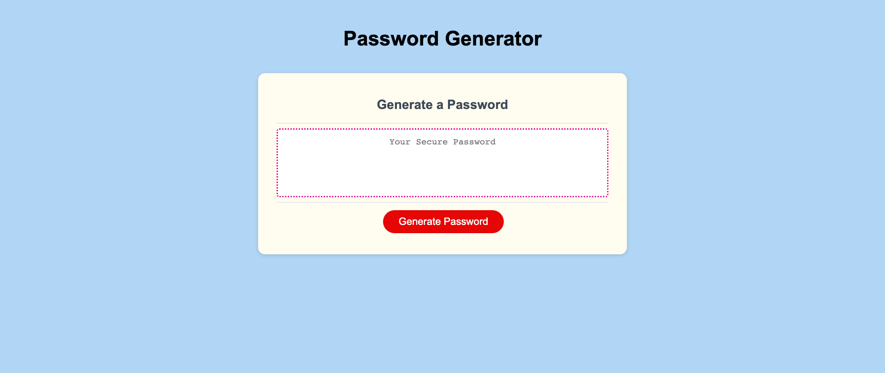

# CP Horiseon Refactoring Challenge 01

## Description

Developed a javascript codebase which creates a random password based on user selected parameters. 

- a series of prompts should be presented to the user
- the prompts will inform the criteria, characters and length of the password
- the password should be between 8-128 characters and the user should not be able to create a password outside this range
- the generated password should match the user selected criteria
- code should be organized and commented

## Usage

File can used and shared to create more secure, random password strings. 

## Credits

a-nyx (Original Source Code)

## License

- GitHub repository URL: https://github.com/cherah-petra/Challenge-03-JS-Password-Generator
- License: license.txt

